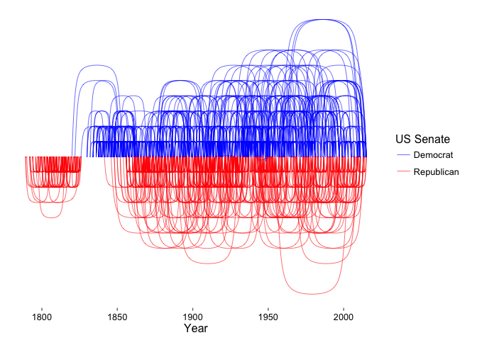
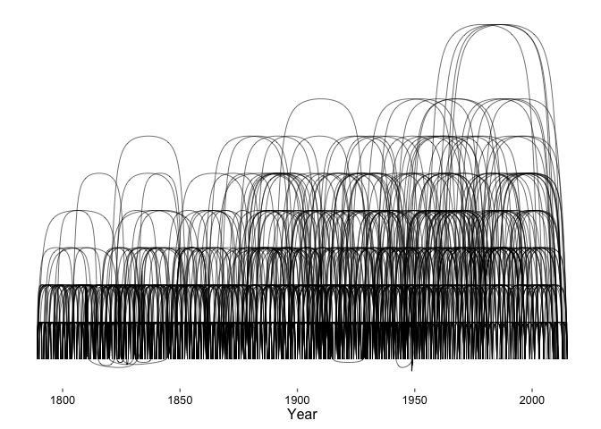
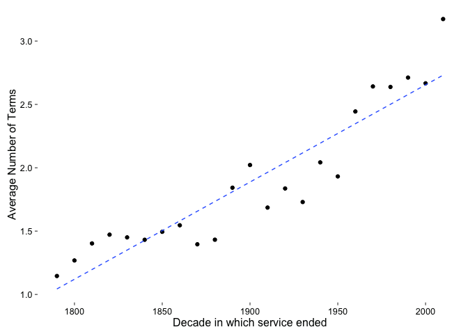
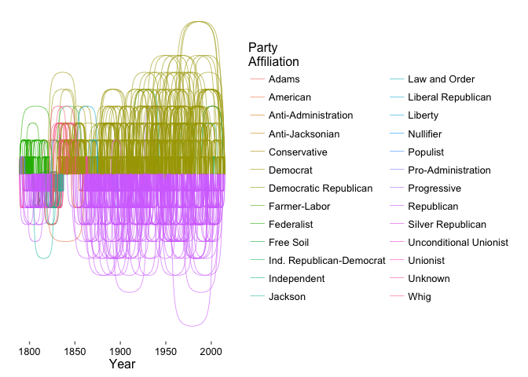
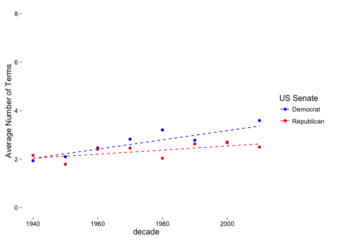
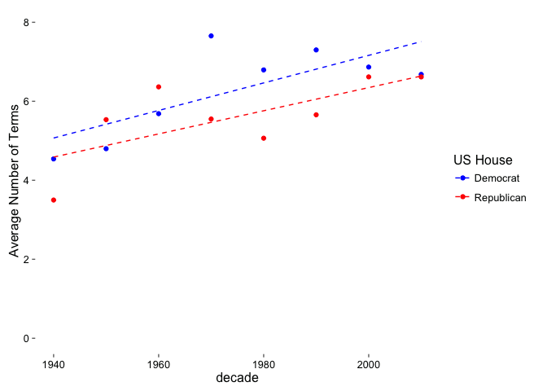
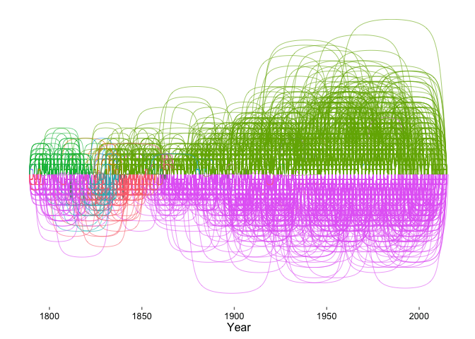
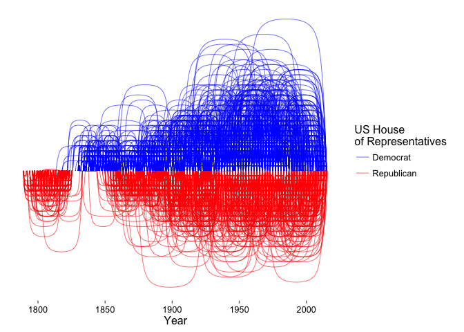

# Legislative Endurance
Brent Schneeman  
March 25, 2016  

## Entrenched Interests

The Founding Fathers created the United States with the concept of citizen servants in mind. Men (originally, and land-owners at that) would represent constituents for a time and then return to their lives. Fresh-off the American Revolution, and having land to tend, this seemed like a good idea: who would want to spend time governing instead of working the land and being a member of the community where you built your life?

After being elected to two terms of the Presidency, George Washington decided to not run again, not wanting to create a democratic monarchy. Soon, the  government codified Presidential Term Limits in the US Constitution. Those term limits never trickled down to the Senate or the House; over time, legislators have spent more and more time legislating at the expense of being a member of their "home" communities.

Today, American Congressional Legislators serve longer terms each decade and have wandered away from the citizen servant ideal. The United States is a much more complex country than it was 230 years ago and perhaps having "professional" representatives is best for the Union. However, the current system of multi-term careers and safe districts leads to entrenched special interests; legislators get elected to careers, not to terms of service to their constituents.

This plot shows the service arcs of every Senator to have *finished* serving (that is, currently sitting Senators are not shown). The heights of the arcs are related to the number of terms served the the horizontal axis progresses by year to the right. The arcs tend to get higher over time, which indicates that Senators are serving longer. The horizontal striations - the *levels* - exactly correspond to the number of terms served: one term, two terms, etc, and the levels get higher towards the right edge of the graph.

A simple scatter plot (with a trend-line) shows the average of the number of terms for every Senator who finished serving in a partcular decade. This clearly shows an up-and-to-the-right increase: the number of terms each Senator is serving is increasing.

## Party time

American politics and political parties go hand-in-hand. America has had lots of Senators from across a wide spectrum of parties serve. Trying to break them out visually is difficult, and probably not all that important. While the "Liberal Republican", "Readjuster", and other parties have a place in American History, today the landscape is dominated by two parties: "Democrat" and "Republican". A two-party system has been in-place since just after the Founding. Our "winner-takes-all" election system tends to suppress third-party efforts as coalitions are formed to garner the greatest number of votes.

Which brings us to the plot at the top of this post (replicated immediately above). It shows every Democrat and Republican Senator who has served since the inception of the Union (not including those currently serving). The image shows the Republican party has two phases. The Republican label has been with the Union since its inception, and then disappeared around 1830, right about the same time the first Democrat Senators appeared. While a few Republicans came back before 1850 (James Simmons, Hannibal Hamlin, John Hale, and others), the party didn't really show strength until between 1863 and 1870 when 47 Republican Senators were elected: "The Party of Lincoln", indeed. Little connection between the early Republican label and the 1860s party likely exists.

Neither party today, however, is likely similar to their 1860s incarnations. [1933 is the start of the Fifth and Sixth party systems](https://en.wikipedia.org/wiki/Political_parties_in_the_United_States#Fifth_and_Sixth_Party_Systems:_1933-present) and since the 1930s, the average number of terms served is on a steadily increasing slope.

The slope of the trendline for the "Democrat" label (0.019) is over twice that of the "Republican" label (0.008), meaning that as each decade passes, a Democratic Senator "gains" twice the longevity as his or her Republican counterpart. For the House of Representatives, the trends look like:

Here, the Democrats "enjoy" a more modest trend advantage. Senate elections are statewide and cannot be "gerrymandered" efficienctly. In the House, both parties benefit from "safe" legislative districts that are designed to protect incumbency. The slopes for the House may relfect this as they are steeper - in each decade, Representatives gain more tenure than their Senate counterparts.

## Most Professional

firstName   lastName     party         numTerms  start        end          dur        
----------  -----------  -----------  ---------  -----------  -----------  -----------
Robert      Byrd         Democrat             9  1959-01-07   2010-06-28   18800 days 
Daniel      Inouye       Democrat             9  1963-01-09   2012-12-17   18240 days 
J.          Thurmond     Republican           9  1955-01-05   2003-01-03   17530 days 
Edward      Kennedy      Democrat             9  1962-01-01   2009-08-25   17403 days 
John        Crittenden   American             4  1817-12-01   1861-03-03   15798 days 
John        Stennis      Democrat             7  1947-01-03   1989-01-03   15341 days 
William     Stewart      Republican           5  1864-01-01   1905-03-03   15036 days 
William     Whyte        Democrat             3  1868-01-01   1909-03-03   15036 days 
Carl        Hayden       Democrat             7  1927-12-05   1969-01-03   15005 days 
Ted         Stevens      Republican           7  1968-01-01   2009-01-03   14978 days 

The top ten longest serving Senators, presented as FYI.

## US House Visuals

For completeness, the US House of Representative versions of many of the above graphs.

## Credits, Rights, and How-to

The source data for these plots is courtesy of [GovTrack.us](https://www.govtrack.us/), and specifically their [historical legislator](https://github.com/govtrack/congress-legislators) YAML dataset. GovTrack releases any of their copyrighted data into the public domain, under a [CC-BY Creative Commons](https://creativecommons.org/licenses/by/3.0/us/) license; I do the same for the plots and code used to create this.

The code used to generate this document is found in [github.com/schnee/ledge-dur](https://github.com/schnee/ledge-dur), specifically in the "endurance.Rmd" document. You will need the R environment to process it; I recommend [RStudio](https://www.rstudio.com/) if you don't already have a suitable environment.
